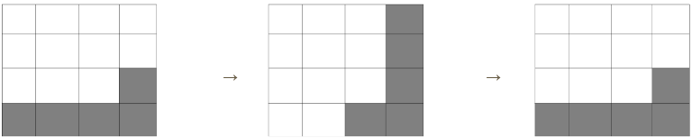
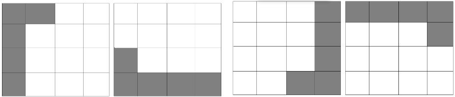

# X-Tetris

## Partecipanti
* Lorenzo Vaccher (matricola: 891921)
* Corò Elia (matricole: 892507)
## Link
[Link relazione in Documenti Google](https://docs.google.com/document/d/1TnKNtrtsvZiEISFd6u0V8dcFj1k6fb3T95S-ayjF9LA/edit?usp=sharing)

[Repository Github](https://github.com/UniveLE/x-tetris)

## Introduzione
Il progetto **X-Tetris** si presenta come una versione rivisitata del classico gioco Tetris. **Il gioco prevede tre modalità** diverse: giocatore singolo, multigiocatore e giocatore contro computer; ciascuna con **tre** diversi **livelli di difficoltà**: semplice, medio e difficile. Ciò che differenzia le tre tipologie di difficoltà è la velocità con cui il tetramino cade.

Durante la fase di sviluppo, **non sono state utilizzate librerie esterne** avanzate (grafica, algoritmi particolari ecc); tutto il codice è stato interamente scritto dai membri del gruppo sopracitati.  

Altra funzionalità particolare aggiunta è il salvataggio dei **punteggi** degli utenti. Infatti, al termine di ogni partita il punteggio ottenuto dal giocatore verrà salvato in un file csv così da permettere di **visualizzare lo storico di tutte le partite**, con relativi **nickname**, **punteggi**, **modalità di gioco** e la **data** della partita. 

I **comandi** utilizzati per muovere il tetramino, sono quelli normalmente utilizzati nei videogiochi classici: **“w”** per ruotare il tetramino, **“s”** per muovere il tetramino verso il basso, **“a”** verso sinistra e **“d”** verso destra. **Nella modalità multiplayer (1vs1)** il giocatore con il campo da gioco posizionato a destra dovrà utilizzare **le frecce direzionali** per muovere il tetramino. Queste utilizzano la stessa logica dei tasti precedentemente analizzati.   

### Strumenti e software utilizzati
Gli strumenti e software utilizzati, utili allo sviluppo del videogioco X-tetris, sono stati:
1. **GitHub**: servizio di hosting che implementa il controllo di versione dei file caricati. Altri strumenti forniti da GitHub e che sono stati utilizzati sono le Actions e i Projects. Le prime per verificare la correttezza del codice e il secondo per gestire il lavoro. 

2. **Visual Studio**: editor di testo utilizzato per  la stesura del codice. Per compilare il programma è stato realizzato un file “MakeFile” configurato per generare l’eseguibile (“tetris”).

3. **Paint JS**: nonostante la banalità di questo strumento è tornato utile come lavagna/foglio per elaborare e accordarsi sulle strategie di gioco e di programmazione.

4. **Docker**: A causa dell’utilizzo di diversi sistemi operativi, e dei vari problemi di compatibilità per le diverse librerie utilizzate, è stato deciso di utilizzare Docker e di generare un ambiente virtualizzato che permettesse, indipendentemente dal sistema operativo, di avviare il gioco con le stesse configurazioni utilizzate in fase di sviluppo.

## Problematiche riscontrate
* **Rotazione dei tetramini nel campo da gioco**:  
    Risoluzione: la rotazione dei tetramini è stata realizzata mediante un sistema che permette di ottenere la sottomatrice quadrata del pezzo in movimento, di ruotarla e di posizionarla nuovamente nel punto originale.  La problematica principale di questa operazione è stata l'effettiva stesura del codice. Inizialmente si pensava di fare la trasposta della matrice ma tale operazione implicava un problema nel momento in cui si applicava per due volte tale operazione alla sottomatrice, come si può notare dalle immagini sottostanti. 

    

    Come si può evincere dalle immagini, con questa metodologia non vi è una rotazione effettiva, ogni tetramino ha quattro possibili posizioni. Per ovviare a questo problema è stato quindi adottato un sistema che permettesse di ruotare la matrice applicando una rotazione dei singoli lati. Nello specifico, partendo dalla parte più esterna e proseguendo fino a quella più interna, ogni lato sostituisce quello successivo. La sottomatrice così ottenuta è l’effettiva rotazione del tetramino:
    

* **Gestione del file “MakeFile” per la compilazione del progetto**  
    Risoluzione: Grazie a diverse dispense e tutorial trovati in rete siamo stati in grado di realizzare un file che permettesse la compilazione del progetto. Questa operazione avviene tramite il comando make che, eseguendo le istruzioni specificate nel file “MakeFile”, permette di generare un file eseguibile secondo lo standard Ansi C.

* **Creazione algoritmo per implementazione player vs CPU**  
    Risoluzione: la creazione di un algoritmo che permettesse di fare giocare un player contro la CPU è stato uno dei punti più discussi in aula. Tale algoritmo è stato realizzato ricorsivamente, cercando la miglior disposizione (in termini di posizione e rotazione) del tetramino attualmente in movimento nel campo da gioco. Per valutare tutte le possibili combinazioni, sono stati adottati due criteri: l’eventuale punteggio ottenuto dalla CPU e, nel caso in cui questo non fosse possibile , l’altezza minima che il tetramino può effettivamente raggiungere rispetto alla parte più bassa del campo.

* **Possibilità di muovere i tetramini in tempo reale**  
    Risoluzione: grazie all’utilizzo della libreria Termios è stato possibile modificare le impostazioni del terminale permettendo così di non bloccare l’esecuzione del codice in caso di input da tastiera per muovere il pezzo in movimento. Grazie a questo meccanismo è stato anche possibile far procedere il tetramino verso il basso, simulando così la gravità.

